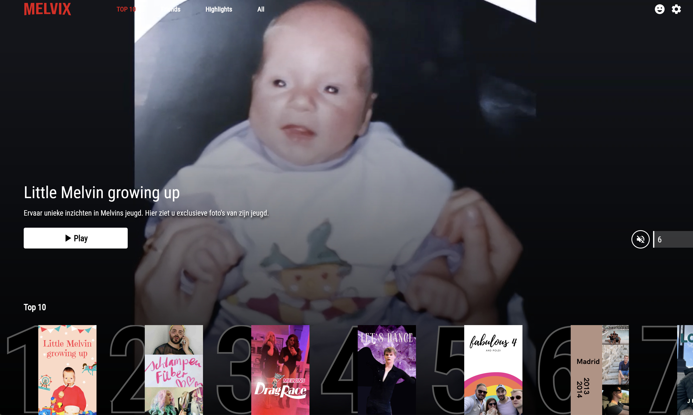

# Melvix

Melvix is a special project created as a birthday gift for my boyfriend, Melvin. It is a Flutter app inspired by the design of Netflix, hence the name "Melvix" (a combination of "Melvin" and "Netflix"). The app showcases a collection of personal videos featuring Melvin and me. Please note that this project is purely for fun and is not intended to be a clean, properly tested software solution.

## Features

- Netflix-inspired design: The app replicates the user interface of Netflix, providing a familiar and intuitive experience.
- TikTok-inspired "For You" page: Melvix features a "For You" page where memories are displayed in a TikTok-like vertical scrolling format, allowing for a fun and engaging browsing experience.
- Video upload functionality: The app includes an upload function that enables the addition of new videos to the "For You" page, providing the opportunity to expand the collection with more cherished memories.
- Firebase hosting: The videos are hosted on Firebase, allowing for easy access and seamless playback.

## Demo

Here's a glimpse of Melvix in action:

## Contributions

As mentioned earlier, Melvix is a fun project and is not intended to be a robust software solution. Therefore, contributions and pull requests are not expected or accepted at this time.

## License

This project is licensed under the [MIT License](LICENSE). Feel free to modify and use the code for your personal projects.

## Acknowledgments

I would like to thank the Flutter community for their incredible support and the creators of Netflix and TikTok for the inspiring designs. Additionally, a special thanks to Melvin for being the reason behind this project.

## Contact

If you have any questions or suggestions regarding Melvix, please feel free to reach out to me at [your-email@example.com].

Thank you for checking out Melvix! Enjoy the personalized video collection and have fun celebrating with your loved ones.
